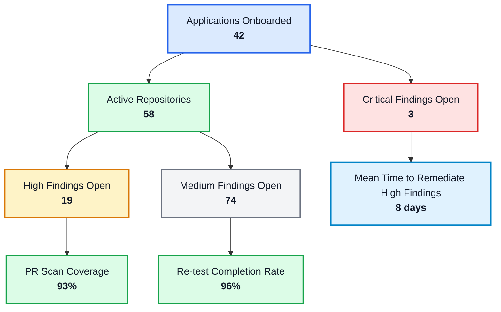
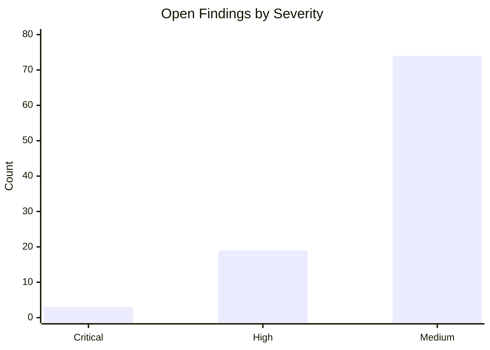
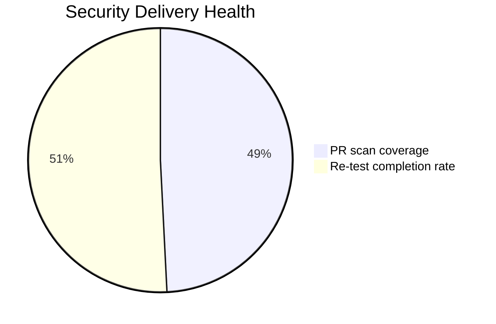
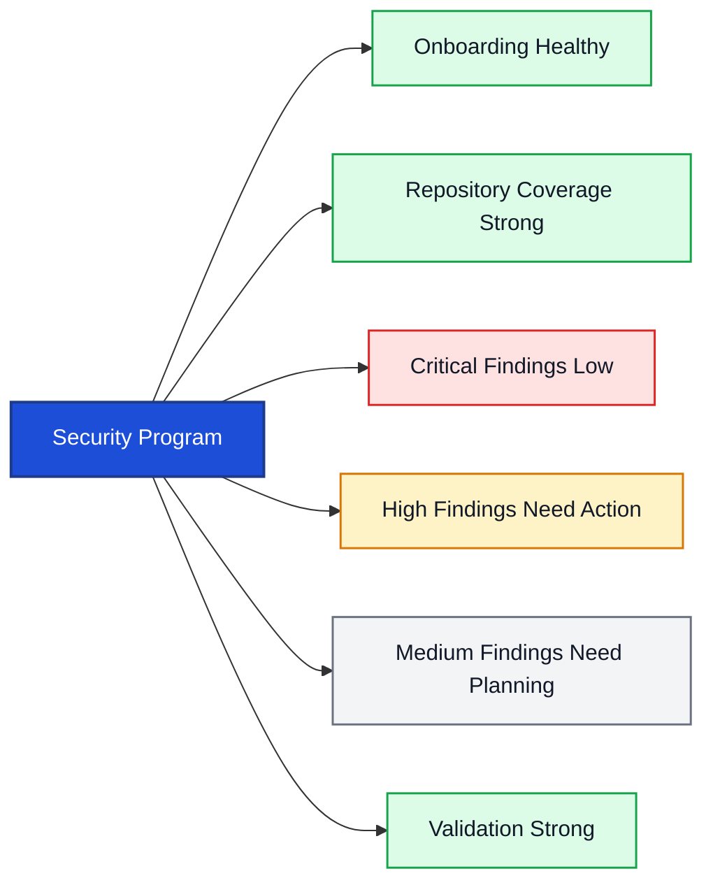

# Application Security Dashboard

A Mermaid-style visual summary of the current application security program.

## Dashboard Overview

## Metrics Table

| Metric | Value | Status |
|---|---:|---|
| Applications onboarded | 42 | Healthy |
| Active repositories | 58 | Healthy |
| Critical findings open | 3 | Needs attention |
| High findings open | 19 | Needs attention |
| Medium findings open | 74 | Monitor |
| Mean time to remediate high findings | 8 days | Good |
| PR scan coverage | 93% | Strong |
| Re-test completion rate | 96% | Strong |

## Severity View

## Delivery Health

## Interpretation

## Key Observations

- **Onboarding is healthy** with 42 applications and 58 active repositories.
- **Critical exposure is low** at 3 open items, but it should remain a priority.
- **High findings need focused remediation** because 19 items are still open.
- **Medium findings form the largest backlog** and should be planned into the normal delivery cycle.
- **Validation is strong** with 96% re-test completion.
- **Preventive scanning is mature** at 93% PR scan coverage.

## Status Snapshot

| Area | Result |
|---|---|
| Onboarding | Healthy |
| Exposure | Attention required |
| Scanning | Strong |
| Verification | Strong |

## Notes

This README is GitHub-friendly and uses Mermaid blocks to give a dashboard-like view directly in the repository.

